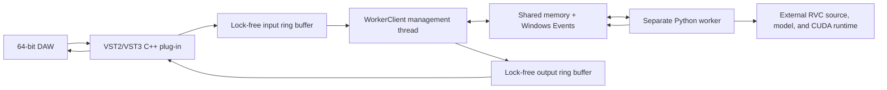

# RVC Realtime VST Developer Guide

[English](./README.en.md) | [简体中文](./README.md)

RVC Realtime VST is a Windows x64 real-time voice conversion plug-in project. The same source tree builds both VST2 and VST3 formats.

The plug-in is implemented in C++17 with iPlug2. Model loading and RVC inference run in a separate Python worker process. The host audio thread only handles audio buffers, mixing, and lock-free queue operations.

This directory does not include a Python runtime, RVC models, index files, training data, or a complete RVC runtime package. None of these runtime files are required to compile the plug-in.

## Supported targets

- Windows 10/11 x64
- 64-bit VST2 DLL
- 64-bit VST3 bundle
- Mono input/output, mono-to-stereo, and stereo input/output
- RMVPE, FCPE, and PM F0 methods
- External 64-bit RVC Python runtime
- `.pth` models and optional `.index` files
- 64-bit VST hosts such as Studio One

Windows x86, macOS, and Linux plug-in targets are not currently configured.

## Architecture



The plug-in starts the package's `runtime\python.exe` with `CreateProcessW` and executes the bundled `worker\rvc_worker.py`. Audio is transferred through Windows shared memory. Named Events synchronize requests and responses. Audio is not transported through network ports, HTTP, or ordinary stdin/stdout pipes.

The Python worker imports the following modules from the RVC root selected by the user:

```text
configs/config.py
infer/rtrvc.py
tools/cuda_graph.py
```

## Source layout

```text
RVCRealtimeVST/
|-- CMakeLists.txt
|-- config.h
|-- src/                         Plug-in, UI, state, and IPC source
|-- worker/rvc_worker.py         Python/RVC inference bridge
|-- resources/                   Windows resources, font, and user guide
|-- scripts/
|   |-- prepare-dependencies.ps1 Validate and prepare locked dependencies
|   |-- build.ps1                Build and create the release ZIP
|   |-- test-all.ps1             VST2, VST3, and optional CUDA tests
|   `-- test-worker.ps1          Real RVC worker test
|-- tools/                       VST2 and worker smoke-test source
`-- third_party/                 Git submodules, compatibility header, licenses
```

## Build requirements

Install the following components:

- 64-bit Windows 10 or Windows 11
- Visual Studio 2022 or Build Tools 2022
- The Visual Studio "Desktop development with C++" workload
- MSVC v143
- A Windows 10/11 SDK
- CMake 3.14 or newer
- Windows PowerShell 5.1 or PowerShell 7
- Git
- Access to GitHub and NuGet during the first configuration

Verified build environment:

```text
Windows 10 22H2 x64
MSVC 19.39.33521
Windows SDK 10.0.20348.0
CMake 3.26.6
```

The following components are not required to compile the plug-in binaries:

- System Python
- An RVC runtime package
- PyTorch
- CUDA Toolkit
- An NVIDIA GPU
- Model or index files

The first iPlug2 CMake configuration downloads WIL and the WebView2 SDK. Subsequent builds can reuse the CMake cache.

## Clone the complete source tree

A recursive clone is recommended. GitHub's Download ZIP archive does not contain the actual submodule contents.

```powershell
git config --global core.longpaths true
git clone --recursive https://github.com/RVC-Project/Retrieval-based-Voice-Conversion-WebUI.git
cd Retrieval-based-Voice-Conversion-WebUI\RVCRealtimeVST
```

For an existing non-recursive clone, run:

```powershell
git submodule update --init --recursive
```

Enabling `core.longpaths` is recommended on Windows because iPlug2 and the VST3 SDK contain deeply nested directories.

## Locked dependency revisions

| Dependency | Commit |
| --- | --- |
| iPlug2 | `5c2df9dce3f5258acfeff3846a6a9563f382212c` |
| Steinberg VST3 SDK | `58f8da7936800732561402d7936584ca4505de07` |
| Xaymar VST2 SDK | `339d4f31590bf77c0d0d248e09a380ac6285e069` |

The VST3 SDK gitlinks additionally lock `base`, `cmake`, `pluginterfaces`, and `public.sdk`. `prepare-dependencies.ps1` validates the outer revisions and initializes the required nested modules.

## Build VST2 and VST3

Run this command from the `RVCRealtimeVST` directory:

```powershell
powershell -ExecutionPolicy Bypass -File .\scripts\build.ps1
```

The script performs these steps:

1. Verify that the three submodules match the locked revisions.
2. Initialize the required nested VST3 SDK modules.
3. Prepare the VST2 and VST3 SDK layout expected by iPlug2.
4. Generate a Visual Studio 2022 x64 CMake project.
5. Build the Release VST2 and VST3 targets.
6. Copy the worker resources using relative paths.
7. Create `dist\RVCRealtime-Win64.zip`.

Primary outputs:

```text
dist/RVC Realtime.dll
dist/RVCRealtime.resources/worker/rvc_worker.py
dist/RVCRealtime.vst3/
dist/RVCRealtime-Win64.zip
```

## Tests

### Format tests without an RVC runtime

```powershell
powershell -ExecutionPolicy Bypass -File .\scripts\test-all.ps1 -SkipWorker
```

This command runs the VST2 dynamic loading and audio processing smoke test, then builds and runs the Steinberg VST3 Validator.

### Real RVC worker test

```powershell
powershell -ExecutionPolicy Bypass -File .\scripts\test-worker.ps1 `
  -RvcRoot "D:\path\to\RVC-package" `
  -Model "D:\path\to\model.pth" `
  -Index "D:\path\to\model.index"
```

`-Python` is optional and defaults to `<RvcRoot>\runtime\python.exe`. `-Index` is also optional.

Run the complete test suite with:

```powershell
powershell -ExecutionPolicy Bypass -File .\scripts\test-all.ps1 `
  -RvcRoot "D:\path\to\RVC-package" `
  -Model "D:\path\to\model.pth" `
  -Index "D:\path\to\model.index"
```

## RVC runtime requirements

At runtime, the user must provide a separate RVC package containing both source code and a Python environment. At minimum, it must provide:

```text
runtime/python.exe             64-bit Python
configs/config.py
infer/rtrvc.py
tools/cuda_graph.py
model files *.pth
index files *.index            optional
```

Verified runtime versions:

```text
Python 3.12.10 x64
PyTorch 2.7.1+cu118
Torchaudio 2.7.1+cu118
NumPy 1.26.4
Librosa 0.10.2.post1
```

These are verified versions, not strict minimum versions. A package that bundles Python, PyTorch, and the CUDA runtime does not require a system Python installation and usually does not require a separate CUDA Toolkit installation. A compatible NVIDIA driver is still required.

## Relative paths in release packages

VST2 loads its worker from a directory next to the DLL:

```text
RVCRealtime.resources/worker/rvc_worker.py
```

VST3 loads its worker from inside the bundle:

```text
RVCRealtime.vst3/Contents/Resources/worker/rvc_worker.py
```

The source directory, developer RVC path, and test model paths are not compiled into the release plug-ins.

## User configuration and logs

The last successfully started path configuration is stored at:

```text
%LOCALAPPDATA%\RVCRealtime\settings.ini
```

Temporary worker JSON, process output, and exception logs are stored at:

```text
%TEMP%\RVCRealtime\logs\
```

The plug-in uses Unicode-safe Windows file APIs and supports non-ASCII usernames and paths.

## Parameters

- Block: `20-1000 ms`
- Crossfade: `10-100 ms`
- Context: `500-3000 ms`
- Effective SOLA overlap: `min(Crossfade, 40 ms)`
- Reported plug-in latency: twice the Block duration in sample frames

Changes to Block, Crossfade, Context, sample rate, or runtime paths rebuild the Python worker. Pitch, Formant, Index, RMS Mix, Gate, and F0 method values are transferred through shared memory while the worker is running.

## Troubleshooting

### CMake reports missing submodules

```powershell
git submodule update --init --recursive
```

Run `scripts\build.ps1` again after the submodules have been initialized.

### Windows reports that a filename or path is too long

```powershell
git config --global core.longpaths true
```

Cloning to a shorter location such as `D:\src\RVC` can also help.

### The plug-in remains on LOADING MODEL or displays ERROR

Inspect:

```text
%TEMP%\RVCRealtime\logs\instance_*.json.process.log
%TEMP%\RVCRealtime\logs\instance_*.json.log
```

Also verify the RVC root, 64-bit Python executable, model, optional index, and NVIDIA driver.

### Rebuild after source changes

Run `scripts\build.ps1` again. CMake reuses the `build` directory for incremental builds. For a completely fresh configuration, remove the locally generated `build` and `dist` directories before running the build script.

## License

Project code in this directory is licensed under the MIT License in `LICENSE.txt`. Third-party components retain their own licenses and copyright notices. See `THIRD_PARTY_NOTICES.md` and the license files in each submodule.
