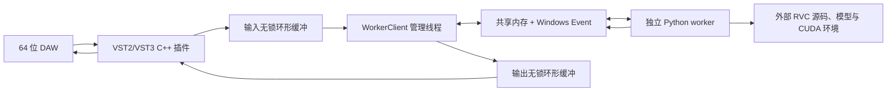

# RVC Realtime VST 开发说明

[简体中文](./README.md) | [English](./README.en.md)

RVC Realtime VST 是面向 Windows x64 的实时变声插件工程，可从同一套源码构建 VST2 和 VST3。

插件本体使用 C++17 和 iPlug2。模型加载与 RVC 推理由独立的 Python worker 进程执行，宿主音频线程只负责音频缓冲、混音和无锁队列操作。

本目录不包含 Python runtime、RVC 模型、索引、训练数据或完整 RVC 整合包。编译插件不需要这些运行时文件。

## 当前支持范围

- Windows 10/11 x64
- 64 位 VST2 DLL
- 64 位 VST3 bundle
- Mono 输入输出、Mono 到 Stereo、Stereo 输入输出
- RMVPE、FCPE、PM 三种 F0 方法
- 外部 64 位 RVC Python runtime
- `.pth` 模型和可选 `.index` 文件
- Studio One 等 64 位 VST 宿主

当前工程未配置 Windows x86、macOS 或 Linux 插件目标。

## 工作原理



插件通过 `CreateProcessW` 启动整合包中的 `runtime\python.exe`，并执行插件自带的 `worker\rvc_worker.py`。音频数据通过 Windows 共享内存传递，请求和响应通过命名 Event 同步，不使用网络端口、HTTP 或普通 stdin/stdout 管道传输音频。

Python worker 从用户选择的 RVC 根目录导入：

```text
configs/config.py
infer/rtrvc.py
tools/cuda_graph.py
```

## 源码结构

```text
RVCRealtimeVST/
├─ CMakeLists.txt
├─ config.h
├─ src/                         插件、界面、状态和 IPC 源码
├─ worker/rvc_worker.py         Python/RVC 推理桥接
├─ resources/                   Windows 资源、字体和用户安装说明
├─ scripts/
│  ├─ prepare-dependencies.ps1  校验并准备锁定依赖
│  ├─ build.ps1                 构建并生成发布 ZIP
│  ├─ test-all.ps1              VST2、VST3 和可选 CUDA 测试
│  └─ test-worker.ps1           真实 RVC worker 测试
├─ tools/                       VST2 和 worker smoke test 源码
└─ third_party/                 git submodule、兼容头和许可证
```

## 编译环境

必须安装：

- Windows 10 或 Windows 11 64 位
- Visual Studio 2022 或 Build Tools 2022
- Visual Studio 工作负载“使用 C++ 的桌面开发”
- MSVC v143
- Windows 10/11 SDK
- CMake 3.14 或更高版本
- Windows PowerShell 5.1 或 PowerShell 7
- Git
- 首次配置时可访问 GitHub 和 NuGet

已验证的编译环境：

```text
Windows 10 22H2 x64
MSVC 19.39.33521
Windows SDK 10.0.20348.0
CMake 3.26.6
```

编译插件本体不需要：

- 系统 Python
- RVC 整合包
- PyTorch
- CUDA Toolkit
- NVIDIA GPU
- 模型或索引

iPlug2 的首次 CMake 配置会获取 WIL 和 WebView2 SDK，因此首次构建需要网络。后续可复用 CMake 缓存。

## 获取完整源码

推荐使用递归 clone。GitHub 网页上的“Download ZIP”不包含 submodule 的实际内容。

```powershell
git config --global core.longpaths true
git clone --recursive https://github.com/RVC-Project/Retrieval-based-Voice-Conversion-WebUI.git
cd Retrieval-based-Voice-Conversion-WebUI\RVCRealtimeVST
```

已有普通 clone 时执行：

```powershell
git submodule update --init --recursive
```

Windows 建议提前启用 `core.longpaths`，因为 iPlug2 和 VST3 SDK 中存在较深的目录结构。

## 锁定的依赖版本

| 依赖 | 提交 |
| --- | --- |
| iPlug2 | `5c2df9dce3f5258acfeff3846a6a9563f382212c` |
| Steinberg VST3 SDK | `58f8da7936800732561402d7936584ca4505de07` |
| Xaymar VST2 SDK | `339d4f31590bf77c0d0d248e09a380ac6285e069` |

VST3 SDK 所需的 `base`、`cmake`、`pluginterfaces` 和 `public.sdk` 由 VST3 SDK 自身的 gitlink 继续锁定。`prepare-dependencies.ps1` 会校验外层提交并初始化必要的嵌套模块。

## 编译 VST2 和 VST3

在 `RVCRealtimeVST` 目录执行：

```powershell
powershell -ExecutionPolicy Bypass -File .\scripts\build.ps1
```

脚本会依次：

1. 检查三个 submodule 的提交是否与锁定版本一致。
2. 初始化必要的 VST3 SDK 嵌套模块。
3. 准备 iPlug2 需要的 VST2/VST3 SDK 目录结构。
4. 使用 Visual Studio 2022 x64 生成 CMake 工程。
5. 构建 Release 版 VST2 和 VST3。
6. 复制相对路径 worker 资源。
7. 生成 `dist\RVCRealtime-Win64.zip`。

主要输出：

```text
dist/RVC Realtime.dll
dist/RVCRealtime.resources/worker/rvc_worker.py
dist/RVCRealtime.vst3/
dist/RVCRealtime-Win64.zip
```

## 测试

### 不使用 RVC runtime 的格式测试

```powershell
powershell -ExecutionPolicy Bypass -File .\scripts\test-all.ps1 -SkipWorker
```

该命令执行 VST2 动态加载和音频处理 smoke test，并构建和运行 Steinberg VST3 Validator。

### 真实 RVC worker 测试

```powershell
powershell -ExecutionPolicy Bypass -File .\scripts\test-worker.ps1 `
  -RvcRoot "D:\path\to\RVC-package" `
  -Model "D:\path\to\model.pth" `
  -Index "D:\path\to\model.index"
```

`-Python` 可省略，此时默认使用 `<RvcRoot>\runtime\python.exe`。`-Index` 也可省略。

执行完整测试：

```powershell
powershell -ExecutionPolicy Bypass -File .\scripts\test-all.ps1 `
  -RvcRoot "D:\path\to\RVC-package" `
  -Model "D:\path\to\model.pth" `
  -Index "D:\path\to\model.index"
```

## RVC 运行环境要求

插件运行时需要用户另外准备包含源码和 Python 环境的 RVC 整合包。至少需要：

```text
runtime/python.exe             64 位 Python
configs/config.py
infer/rtrvc.py
tools/cuda_graph.py
模型文件 *.pth
索引文件 *.index              可选
```

当前已验证的 runtime 版本：

```text
Python 3.12.10 x64
PyTorch 2.7.1+cu118
Torchaudio 2.7.1+cu118
NumPy 1.26.4
Librosa 0.10.2.post1
```

这些是已验证版本，不代表全部最低版本。使用自带 Python、PyTorch 和 CUDA 运行库的整合包时，不需要安装系统 Python，也通常不需要另外安装 CUDA Toolkit；仍需要兼容的 NVIDIA 驱动。

## 发布包中的相对路径

VST2 从 DLL 同级目录读取：

```text
RVCRealtime.resources/worker/rvc_worker.py
```

VST3 从 bundle 内读取：

```text
RVCRealtime.vst3/Contents/Resources/worker/rvc_worker.py
```

源码目录、开发机 RVC 路径和测试模型路径不会编译进发布插件。

## 用户配置与日志

最后一次成功启动的路径配置保存在：

```text
%LOCALAPPDATA%\RVCRealtime\settings.ini
```

临时 worker JSON、进程输出和异常日志保存在：

```text
%TEMP%\RVCRealtime\logs\
```

插件使用宽字符 Windows 文件接口，支持中文用户名和中文路径。

## 参数说明

- Block：`20-1000 ms`
- Crossfade：`10-100 ms`
- Context：`500-3000 ms`
- 实际 SOLA overlap：`min(Crossfade, 40 ms)`
- 插件报告延迟：两倍 Block 对应的采样帧数

Block、Crossfade、Context、采样率或运行路径变化会重建 Python worker。Pitch、Formant、Index、RMS Mix、Gate 和 F0 方法会在运行期间通过共享内存传递。

## 常见问题

### CMake 提示 submodule 缺失

```powershell
git submodule update --init --recursive
```

然后重新运行 `scripts\build.ps1`。

### Windows 提示文件名或路径过长

```powershell
git config --global core.longpaths true
```

也可把仓库 clone 到更短的路径，例如 `D:\src\RVC`。

### 插件停留在 LOADING MODEL 或显示 ERROR

检查：

```text
%TEMP%\RVCRealtime\logs\instance_*.json.process.log
%TEMP%\RVCRealtime\logs\instance_*.json.log
```

同时确认 RVC 根目录、64 位 Python、模型、索引以及 NVIDIA 驱动均有效。

### 修改后如何重新构建

直接再次运行 `scripts\build.ps1`。CMake 会复用 `build` 目录进行增量编译。需要完全重新配置时，删除本地生成的 `build` 和 `dist` 后再执行构建脚本。

## 许可证

本目录的项目代码使用 `LICENSE.txt` 中的 MIT 许可证。第三方组件保留各自许可证和版权声明，详见 `THIRD_PARTY_NOTICES.md` 与各 submodule 内的许可证文件。
